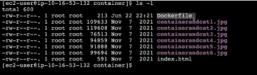
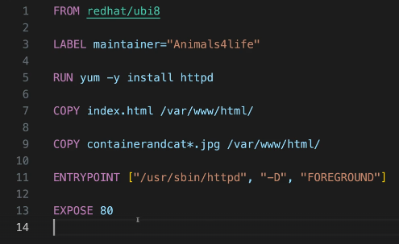
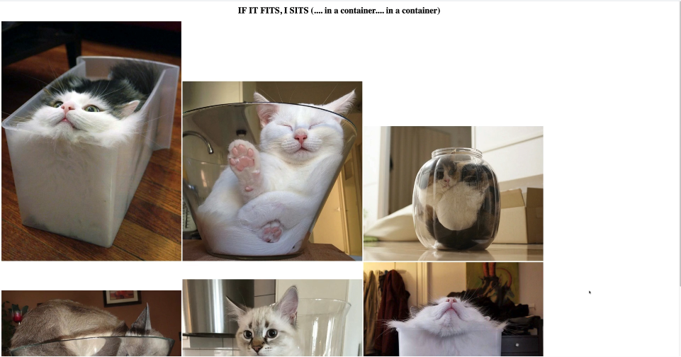

# Creation of Docker Containers Image

In this project we create a docker image with a container.
We will install the docker engine on an EC2 Instance and use this to create the image.
To test the image we will 'RUN' the image, creating a docker container and once tested, upload some images to dockerhub. <br/>

1 - As always, make sure you're logged to the main AWS account of your organization within the us-east-1 region. <br/>

2 - Next, attached to the project you will find a CloudFormation preconfigured template. Once run in CloudFormation, it will deploy an EC2 Instance which much of its configuration already performed. This step will sped up the things through the project. <br/>

3 - Once the template stack has been created successfully, move to the EC2 console, right click on the public instance launched by the stack and select 'Connect'. Pick the 'Session Manager' method (no need to provide session keys) and click on 'Connect'. It may take some minutes but once connected a black terminal screen should be visible. <br/>

4 - Next, we will install the Docker Engine, responsible of running the Docker containers within the EC2 Instance, so run the prompt below in the terminal: <br/>
```
sudo dnf install docker
```
This will start the installation of Docker. You may need to wait some moments before the installation is completed. <br/>

5 - Start the Docker service: <br/>
```
sudo service docker start
```
<br/>

6 - Now we need to test we can interact with the Docker engine, so run the command below: <br/>
```
docker ps
```
An error will raise, and that issue comes from the fact we have not allowed any user access to Docker yet. We are going to fix that by adding all users to a group
```
sudo usermod -a -G docker ec2-user
```
<br/>

This will enable to the 'ec2-user' user within the 'docker' group access to the engine (here, '-G' stands for group). That will allow any local user of the system (specifically, 'ec2-user') to be able to interact with the Docker engine. <br/>

7 - Next, we need to log out and log in back from the instance, so in therminal run: <br/>
```
exit
```
This will disconnect from the Session Manager, saving and updating all changes we have performed so far. Once out, click again on 'Connect' and we will be back to the instance terminal. <br/>

8 - Next, as we granted permissions to the 'ec2-user', log in as the 'ec2-user' typing the command below: <br/>
```
sudo su - ec2-user
```
The reason we are doing it this way it is because we use Session Manager so we do not need SSH session keys (we can directly connect using the console UI). Test we can interact with the Docker engine by running:<br/>
```
docker ps
```
A list of the runnings containers (so far, none) should be yielded if we are logged in successfully, that means everything is okay. <br/>

9 - The instance deployed via CloudFormation was preconfigured such that the compressed Docker engine file is extracted automatically, so no need to extarct again. In fact, we will proceed with the Docker Image creation. First, move to the 'container' directory: <br/>
```
cd container 
```
We can check the directory is prepopulates by typing: <br/>
```
ls -l
```
This is the expected outome. <br/>



We can see the folder is already populated with some sample pictures as well as an index.html, responsible of showing the frontend of the instance. Furthermore, a Dockerfile can be found, which is the file the Docker engine will use to create the Docker image. One can inspect the content of the Dockerfile file by opening it on a text editor. <br/>



Each of these lines is a directive to the Docker file to perform a specific task. The first line tells the Docker engine to use the 8th version of the RedHat universal base image, the next line jsut describes the who's the maintainer of the image (optional). Next, some software installation is run, specifically the Apache web server. Next, the index.html file is copied from the local folder and put its inside the Docker image within the path ```/var/www/html/``` (this is where an Apache web server expects this index.html file to be located). The command below performs the same process but for the jpg files. Next line states the EntryPoint and essentially determines what is first run when this Docker image is used when creating a Docker container (in this example, the first thing to run will be the Apache web server). Finally, the 'Expose' command tells the Docker image what services should be exposed (it simply tells the Docker engine what port is used, in this case port 80). <br/>

10 - Next, build a Docker container from the files mentioned before located in the ```.``` directory (current working directory): <br/>
```
docker build -t <name of your docker image> .
```

11 - We can check the image has been successfully created filtering the images of the docker by its name: <br/>

```
docker images --filter reference=<name of your docker image>
```

12 - Now, run the container from the image: <br/>

```
docker run -t -i -p 80:80 <name of your docker image> 
```

It tells Docker to map port 80 on the container with port 80 on the EC2 instance. Check the container has been run successfully by going back to the EC2 console, copying into the clipboard the IPv4 of the instance and pasting it into a new web browser tab. The output should look like this: <br/>



13 - This final step is optional, and covers the upload of the Docker image to DockerHub so images can be reused (also, can only be done if you already have a DockerHub account). For that purpose, move back to the Session Manager tab and exit the running container by pressing Ctrl+C. Next, log in the Docker service using your account username: <br/>

```
docker login --username=<your username>
```

Next, we will be asked to provide our DockerHub password. <br/>

14 - Once you have entered your password, we will be logged in our DockerHub. Now, check all images available to be uploaded: <br/>

```
docker images
```
And into the clipboard baste the ID of the image we aim to upload. Next, run this command to prepare the upload: <br/>

```
docker tag <image id> <your dockerhub username>/<your image name>
```

And finally push the image to DockerHub: <br/>

```
docker push <your dockerhub username>/<your image name>:latest
```

By adding ```:latest``` at the end we're explicitly tagging the image with the latest tag, which is the default tag Docker assigns if none is specified. <br/>

15 - The last thing which remains to do is to delete the stack we deployed at the very beggining of the project so we get back to the initial state. <br/>


