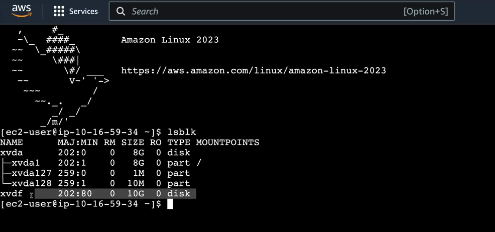

# EBS Volumnes 

In this DEMO lesson, we will interact with EBS, Instance Store Volumes, and EC2. We will begin by creating an EBS volume and mounting it to an EC2 instance. Once attached, we will create and mount a file system on this volume and generate a test file to verify data persistence. Next, the volume will be migrated to another EC2 instance within the same Availability Zone, ensuring that both the file system and the test file remain intact after the move. Following this, a EBS snapshot of the volume will be created, and from that snapshot, provision a new EBS volume in a different Availability Zone (AZ-B). Again, we will verify that the file system and test file are present and unaltered.
We will then copy the snapshot to another AWS region, enabling cross-region data portability. <br/>
After working with EBS, a EC2 instance will be launched such that it uses instance store volumes. We will create a file system and a test file on the instance store volume. Upon restarting the instance, we will confirm that the file system remains intact. However, after stopping and starting the instance — which causes a change in the underlying EC2 host — one will be able to observe that the file system and its contents are no longer present, demonstrating the ephemeral nature of instance store volumes. <br/>

1 - To get started with this project we will need to deploy beforehand some infrastructure. To do that make sure we are logged in the N.Virginia region. Attached to the repo you can find a CloudFormation template moving the starting point to where we left at the VPC repo (VPC created and populated with a number of subnets with public Internet access). Wait until the stack has been successfully created. This template will create a number of resources. However, our attention will go to the 3 instances called 'Instance1', 'Instance2' and 'Instance3'. <br/>

2 - Let's take a look on these instances moving to the EC2 console and clicking on 'Instances' on the menu on the left. 3 instances will be displayed: 'A4L-EBS-INSTANCE1-AZA', 'A4L-EBS-INSTANCE2-AZA' and 'A4L-EBS-INSTANCE1-AZB'. The first 2 are alocated within the same AZ (A) while the latter runs within AZ B. All 3 share the same instance type (falling into the free tier). <br/>

3 - Next, on the menu on the left scroll down and select 'Volumes'. The CloudFormation template should have created a single EBS volume for each instance, providing boot volumes (all 3 hold a size of 8 GiB and a number of IOPS of 3000). Let's get some hands on experience creating EBS volumes so click on 'Create volume'. One thing that needs to be configured is the 'Volume type'. For this lesson pick the 'General Purpose SSD (gp3)' on the dropdown as it is a volume type mostly used for general purposes (see that IOPS and GiB are linked together in this volume type). In case IOPS and GiB rates need to be managed independelty, select an 'io' volume type listed below the 'gp' options (addressed for scenarios where high performance is demanded on small volumes) (recently AWS launched the 'io2' volume type which outperforms on most cases 'io1'). The rest of available volume types are either destined to specific scenarios or legacy (Magnetic (standard) which is unrecommendable for production stages). In this lesson we wille 'gp3' volume type. Next, in the 'Size (GiB)' box select a size of 10 (it will be enough for our project) and an IOPS rate of 3000. Also, under 'Availability Zone' select the 'us-east-1a' region we are currentlly working witin. In this stage of the project we will neither create the EBS volume from a snapshot nor configure any kind of encryption on the volume so leave the rest on default. Finally, enter a name tag for the volume and click on 'Create volume'. <br/>

4 - It may take a certain amount of time to make the volume available. Once it's over, right click on it and select 'Attach volume'. See that EBS volumes are constrained to only be attached to those instances running within the same AZ, so in the 'Instance' dropdown only the instances sharing the same AZ will be displayed. At this stage, select the Instance1 running in AZ A. Below you will see the 'Device name' box is already populated (actually, Device name stands for the device id the instance will see for this volume so this is how the volume will be exposed to the instance). As the warning below suggests, depending on the kernel running the device name may vary. For now, leave it on default and click on 'Attach volume'. <br/>

5 - Let's test out the instance once the volume is attached to it, so move to the EC2 console, select the Instance1 instance in AZ A, right click on it and then click on 'Connect'. We will connect via the web browser so pick the 'Instance Connect' connect method. Next,
below we will run a series of prompts to interact with the volume. Sart by checking what block devices are connected to the instance:<br/>
```
lsblk
```
The output should look like this in the terminal: <br/>



You will find two blocks: the first (xvda) stands for the instance running system (which is 8 GiB in size) while the latter (xvdf) stands for the EBS volume we attached earlier (with 10 GiB). Check if any file system is alocated within the volume by typing on the terminal the prompt below: <br/>

```
sudo file -s /dev/xvdf
```
If 'data' is yielded, then the volume does not contain any file system so we need to create it within this raw block device. So to do that we will run the command below: <br/>
```
sudo mkfs -t xfs /dev/xvdf
```
The prompt above is read as 'using sudo permissions create a xfs type file sistem within the /dev/xvdf block device'. Press enter and confirm the creation of the file system as successful by running again the prompt 2 steps above (now the response should not be 'data'). <br/>

6 - Now, the way Linux works is by mounting a file system to a mounted endpoint which is a directory, so we are going to create a directory called 'ebstest'321º by using the command below: <br/>

```
sudo mkdir /ebstest
```

7 - Next, let's mount the file system to the directory recently created: <br/>

```
sudo mount /dev/xvdf /ebstest
```
Press enter and verify the file system is successfully mounted to the folder entering the prompt below: <br/>

```
df -k
```

8 - Next, we will move to the file system: <br/>

```
cd /ebstest
```
Once on that folder, we will create a test file called 'testfile.txt' and enter some text on it: <br/>

```
sudo nano textfile.txt
```
Type whatever you want and save it by pressing Ctrl + O + Enter and Ctrl + X to exit. You should be able to see the content of the file by typing on the terminal: <br/>

```
ls -la
```
or see its full content typing ``` cat textfile.txt ```. So far we have set the folder as the mounted point of the file system within the volume attached to the instance, now reboot the instance by typing ```sudo reboot```.<br/>

9 - After that, we will see the the file system has been rebooted as well since it was mounted manually. Fix that by manually mount it to the EBS volume. For that matter, we will first get the unique identifier of our EBS volumes by typing the prompt below in the terminal: <br/>

```
sudo blkid
```
Next, copy into the clipboard the ID of the EBS volume. <br/>
Once you've done that, let's configure the file which tells the instance what EBS volumes are mounted and where. For that matter, type into the terminal the prompt below: <br/>

```
sudo nano /etc/fstab
```
We will then access to the configuration file where it is told what file systems are mounted by our instance. We are going to add a new similar line. Add what's below: <br/>

```
UUIDS=<unique id we just copied into our clipboard previously> /ebstest xfs defaults,nofail
```
The line above tells the instance to mount the <...> EBS volume to the folder ebstest (created as well previously) within the xfs file system. Once entered all of that, press ```Ctrl+O``` to save that file and ```Ctrl+x``` to exit. <br/>

10 - Finish up the mounting stage by mounting all volumes listed in the fstab file: <br/>

```
sudo mount -a
```
You can check now that the volume has been successfully mounted to the folder ebstest by typing ```df -k```. Actually, we can check the file ```textfile.txt``` is still persistent after the rebooting by typing ```ls -la```. <br/>

11 - Once you've done that, we will no longer use this instance so exit the terminal, right click on the Instance 1 located within AZ A and stop it. Next, move to 'EBS volumes' on the menu on the left and once you're there right click on 'EBSTestVolume' and click on 'Dettach'. As you can see, EBS volumes live apart from instances, preserving the content stored within them. We will prove that by right click again on this EBS volume and select 'Attach volume' (we need to keep refreshing the volume until it has moved to the 'Available' state (it has been successfully detached from Instance 1 in AZ A)). This time, attach the instance to the Instance 2 running in AZ A. Save the changes. <br/>

12 - Move back to the EC2 console and connect using Instance Connect to Instance 2 within AZ A. See that the instance has not interacted with the EBS volume yet, therefore it is not mounted. One can check that by typing on the terminal ```df -k``` and not finding the ebstest folder. We will mount the EBS volume to this instance by running the prompts below in the terminal: <br/>

```
sudo mkdir /ebstest # creates the ebstest folder
sudo mount /dev/xvdf /ebstest # mounts the xvdf file system within the ebstest folder
```
Once you've done that, you can check by yourself that the textfile.txt persist within the volume since it lives past the instance lifecycle (completely separated from the instance) by running the prompts below: <br/>

```
cd /ebstest # move to the ebstest directory
ls -la # retrieve a list of all files within the ebstest directory
```

13 - Remember that Volumes live only within a single AZ and therefore cannot be mounted to instances located within different AZs. However, one can solve it by creating a snapshoot of the volume, storing it on S3 and recovering it in the destination AZ (it allows us to move on volume from the source AZ to another). So right click on the volume in the EBS volumes console and next click on 'Create snapshoot'. Next, enter a description for the snapshoot and click on 'Create snapshoot'. You can check the snapshoot was successfully created by moving to the menu on the left and clicking on 'Snapshoots'. It may take some time to create it depending on the size of the content stores within the volume. Since the snapshoot is stored within S3, it means we can right click on it and click on 'Create volume from snapshoot'. We can change the volume type as well as the size and the AZ. For the last setting, change the AZ from us-east-1a to us-east-1b. On tags, enter a name so it can be easily identified and save the changes. <br/>

14 - After that, move to 'EBS volumes' in the menu on the left and the recently created volume should be displayed. Right click on it, click on 'Attach volume' and in the instances dropdown all instances located within AZ B should be available. Select it, save changes and connect to the instance you picked before using Instance Connect. After that, follow the steps above regarding how to mount the volume. At the end, after moving to the ebstest folder and typing ```ls -la``` into the terminal the textfile.txt should be visible. <br/>

15 - What's more, snapshoots can be forwarded to different AWS regions by right clicking on the snapshoot and next click on 'Copy snapshoot'. This will provide the capability of migrating snapshoots to external AWS regions in disaster scenarios. <br/>

### **ATTENTION!**
The steps below fall apart from the free tier plan. <br/>

14 - In this part of the demo we will interact with Instances Store Volumes. It approximately has a cost of 13 cents per hour, so proceed with the steps below if you're willing to pay that amount, otherwise just take notes on how to do it. First, we will launch an instance manually by moving to the EC2 console and clicking on 'Launch and instance'. Enter a name for the instance, scroll down and pick the 'Amazon Linux 2023 AMI' as well as the '64-bit (x86)' options just below the first. Scroll down and in the instance type box we need to pick one which supports Instance Store Volumes. For this part of the project, we will be working with the 'm5dn.large' which supports the feature mentioned previously. Scroll down a little bit and in the 'Key pair' select 'Proceed without a key pair (Not recommended)' (even it is not recommended we will just go straightforwardly to test the instance store volume feature). Click on the 'Network settings', next click on the 'VPC' and pick the VPC we created before. Next, on the subnet dropdown select subnet 'sn-web-A'. Also, enable both 'Auto-assign public IP' and 'Auto-assign IPv6 IP' features. Scroll down, select a Security Group if you have one and in the 'Configure storage' we will leave it on default. What we can do though is to click on 'Show details' and see all the details of the instance store volume associated with this instance type (one instance store volume with a size of 75 GB  with its own device name). Go ahead and click on 'Launch instance'. Wait until the instance state was moved to completed. <br/>

15 - Connect to the instance using Instance Connect. Here, we will be running the prompts listed in the earlier stages of the project. Its behaviour is similar to EBS volumes (if the instance is rebooted, the content stored within the instance store volume will not change at all) except in the scenario the instance is stopped. In that case, and after restarting it, the content of the instance store volume is permanently lost (any file system or file created earlier in the instance store volume). To summarize, Instance Store Volumes are ephemeral, they are not persistent and cannot rely on them to keep your data safe (it is critical to underline the key differences between restarting and stopping an instance: the first changes the host where the instance was located to while the latter do not. As a result, the public IPv4 of the instance changes at the restarting stage).

16 - To end up with the project, tidy up and terminate all resources created throughout the project so we are not billed by services which fall apart from the free tier plan. <br/>

