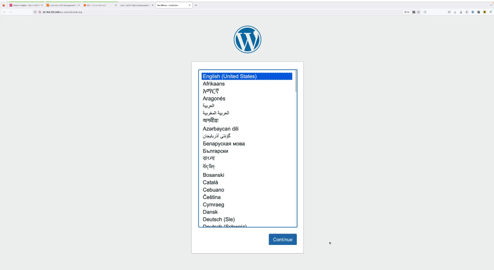

# Manual Installation of Wordpress on AWS Instances

As the title of the project states, we will install Wordpress to our instance manually. We will use EC2, install MariaDB, Apache and libraries and then download and install Wordpress. The architecture will be monolithic (everything installed within a single EC2 instance). That means both the application and the database will be located within the same instance. Also, it is worth to mention the instance will be located within a single subnet within a VPC which will be automatically created and deployed via CloudFormation.<br/>

1 - Make sure we are logged in to the general AWS account (management account of the organization) as well as we are located within the us-east-1 AWS region. <br/>

2 - Attached to this project you will find a CloudFormation template to deploy all the required initial resources to start with the project (deployment of the VPC template). Deploy the stack using CloudFormation and wait until it has moved to complete state. <br/>

3 - Move across the EC2 console (we will install Wordpress manually). Click on 'Instances running' and we should see one instance running called 'A4L-PublicEC2', right click on it, select 'Connect' and connect to the instance via 'Instance Connect'. Once the terminal is opened on a new tab, we will create a range of variables which will be constant throughout the project: one for the database name, one for the database user, another one for the database password and then one for the root or admin password of the database service. Let's start by typing in the terminal the value of each of these variables: <br/>

```
DBName='a4lwordpress'
DBUser='a4lwordpress'
DBPassword='<whatever you want>'
DBRootPassword= '<whatever you want>'
```
Confirm the creation of these variables by typing in the terminal: <br/>
```
echo $<name of your variable>
```
4 - Next, let's install some system software so there are a few things we need to install in order to allow Wordpress installation. We will allow the installation using dnf (including web and DB): <br/>
```
sudo dnf install wget php-mysqlnd httpd php-fpm php-mysqli mariadb105-server php-json php php-devel -y
```
In other words, we will be isntalling the software of the MariaDB database and further components using the command ```wget```. <br/>

5 - Now that all prerequisites are installed, we will start both the web and database servers and make sure they are restarted everytime the instance is restarted as well. To do that, we need to enable and start those services. First, we will use the command below: <br/>

```
sudo systemctl enable httpd
sudo systemctl enable mariadb
```
Now, Web and DB Servers (listed in order above) are Online and set to startup. Now, start both services: <br/>

```
sudo systemctl start httpd
sudo systemctl start mariadb
```

Now our instance has both a web and database servers running, required to run Wordpress. <br/>

6 - Now, let's set the root user database password (that we sat before at the beggining of the project): <br/>

```
sudo mysqladmin -u root password $DBRootPassword
```

7 - Next step is to install the Wordpress application. For that matter, we need to run on the terminal the following steps in the order below. First, downlaod the compressed file containing the Wordpress installation files to the ```/var/www/html``` folder: <br/>
```
sudo wget http://wordpress.org/latest.tar.gz -P /var/www/html
```
Extract the .tar.gz file after moving to the ```/var/www/html``` directory: <br/>
```
cd /var/www/html
sudo tar -zxvf latest.tar.gz
```
Once you've done that, we need to move all these files (within the ```wordpress``` folder) to the ```.``` folder, this is, the current folder: <br/>
```
sudo cp -rvf wordpress/* .
```
Once you've donde that, remove the ```wordpress``` so we do not have repeated files across the system: <br/>
```
sudo rm -R wordpress
sudo rm latest.tar.gz
```

8 - In this step we will manage the configuration of the Wordpress application. From the files extracted beforem, there is one particularly important which contains he configuration of the application called ```wp-config-sample.php ```. Take this template and change its name to rename it properly to ```wp-config.php``` (this is the file name Wordpress expects when running and setting its configuration): <br/>
```
sudo cp ./wp-config-sample.php ./wp-config.php
```
We can check its content running in the terminal ```sudo nano wp-config.php```. Notice that in the content retrieved there are some placeholders, exactly where our variables created at the very beggining of the project must go to. Fill in the blanks with the commands below: <br/>
```
sudo sed -i "s/'database_name_here'/'$DBName'/g" wp-config.php
sudo sed -i "s/'username_here'/'$DBUser'/g" wp-config.php
sudo sed -i "s/'password_here'/'$DBPassword'/g" wp-config.php
```
Listed in order, the database name, username and password are entered manually, respectively. <br/>

9 - One last step to finish the Wordpress manual installation: allow the web server to access all these resources: <br/>
```
sudo chown apache:apache * -R
```
This will move the ownership of these files to the user 'apache' within the 'apache' group (which belongs to the web server). <br/>

10 - Next, we need to create the databse Wordpress will use. That can be done by first creating a ```db.setup``` file which will trigger the creation of the database and then adding one by one the prompts to the ```db.setup``` which will configure the database. Run the commands below sequentially: <br/>
```
echo "CREATE DATABASE $DBName;" >> /tmp/db.setup
echo "CREATE USER '$DBUser'@'localhost' IDENTIFIED BY '$DBPassword';" >> /tmp/db.setup
echo "GRANT ALL ON $DBName.* TO '$DBUser'@'localhost';" >> /tmp/db.setup
echo "FLUSH PRIVILEGES;" >> /tmp/db.setup
```
Listed in order, first create the database under the name of the value of the variable created at the beggining ```$DBName```, and enter that to the ```db.setup``` file stored within the ```tmp``` directory. Next, create our Wordpress database user, set its password and enter it to the setup file. Next, grant full permissions to the user to access and manage the database, and lastly flush privileges such that the grant tables are flushed so changes to user permissions take effect. These commands are intended to be run by the MariaDB platform, that final step can be done by running the prompt below in the terminal: <br/>
```
mysql -u root --password=$DBRootPassword < /tmp/db.setup
```
Now our Wordpress database is successfully running. To tidy up things, make sure the setup file is deleted (it will no longer be used as the database configuration has been already set): <br/>
```
sudo rm /tmp/db.setup
```

11 - One can check the Wordpress application runs as expected by moving back to the EC2 console, copying into the clipboard the EC2 instance IPv4 public address and pasting it to the web browser on a new tab. This is the expected outcome: <br/>



12 - As always, remove and delete all the resources created throughout the project so things do not start getting messy. Proceed with this final step if you do not aim to step through [AMICreation](https://github.com/bmestref/AWS-SAA-Projects/EC2/ManualInstallation) project, which continues inmediately after the current repo. <br/>

In the real world manual installations are legacy or avoided as much as possible. As an alternative, AWS provides the AMI service, an image of an instance which automates the creation and deployment of a series of resources from AWS. 

