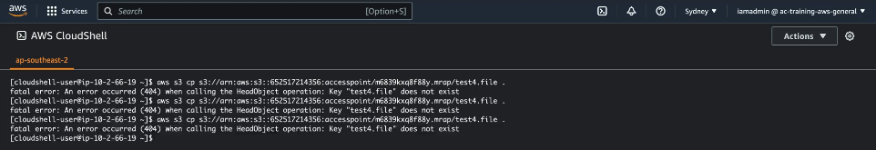

# Multi-Region Access Points (MRAP)

Amazon Simple Storage Service (S3) Multi-Region Access Points provide a global endpoint for routing Amazon S3 request traffic between AWS Regions. Each global endpoint routes Amazon S3 data request traffic from multiple sources, including traffic originating in Amazon Virtual Private Clouds (VPCs), from on-premises data centers over AWS PrivateLink, and from the public internet without building complex networking configurations with separate endpoints. In this mini project we will cover Multi-region access points.

1 - Make sure you are logged in AWS using your admin account (with admin permissions, this is, the management account of the organization). In this mini project we will create two buckets on different regions: first on Asia Pacific (Sydney) (ap-southeast-2) and Canada (Central) (ca-central-1). We will create the first bucket in the Sydney region so make sure this region is selected, then move to the S3 console and open it on a new tab. Click on 'Create bucket' and provide a consistent name for the bucket, below make sure the correct region is selected, scroll down and check 'Enable' below 'Bucket versioning', scroll to the bottom and click on 'Create bucket'. Follow the same steps for the second bucket except picking the Canada region and providing a different and unique bucket name. <br/>

2 - Once the buckets are created, we will step trhough the creation of the multi-region endpoint, so click on 'Multi-Region Access Points' in the menu on the left and next on 'Create Multi-Region Access Point'. For the name you can pick whatever you want (it does not need to be globally unique but instead unique in your AWS account), scroll down and click on 'Add buckets' on the 'Buckets' box. Add the buckets created in the previous step. Scroll down to the bottom and click on 'Create Multi-Region Access Point'. This process can take up to 24 hours in the worst cases to complete but tipically it created much faster (from 10 to 30 minutes), so wait until the endpoint is ready to go.<br/>

3 - Next, we need to enable cross-region replication between both buckets since any incoming traffic to the endpoint will be automatically rerouted to the closes S3 bucket, so click on the Multi-Region Access Point we have just created and next on the 'Replication and failover' tab and you will be able to see a graphical representation of any Replication or Failover configuration. <br/>


4 - Scroll down a little bit and we will come across the Failover Configuration. If we click on one of the buckets and next click on 'Edit' on the Routing Status tab we will be able to pick between 'Active' or 'Passive'. The configured to 'Passive' then the traffic will be only routed to this bucket if no active buckets exist. On our case leave the failover configuration of both buckets to 'Active'.<br/>

5 - As mentioned before we needed to enable replication between buckets so scroll down and in the 'Replication rules' panel click on 'Create replication rules'. Two templates will be made available, and the choise of one or another depend on the type of configuration of our cross-region architecture. Since the set the failover configuration to 'Active' on both buckets, the first template will be fine (we want all the buckets to be the same, so pick the 'Replicate objects among all specified buckets' option). <br/>

6 - Scroll down a little bit and select both buckets were the template will be applied to. <br/>

7 - In the replication panel make sure the 'Enabled' replication setting is picked. <br/>

8 - Next, in the 'Scope' section pick 'Apply to all objects in the bucket' in order to apply the same replication rule to all buckets within this architecture and not filter out by object type. <br/>

9 - Because of the template choice done before, we cannot customize the Encryption configuration so leave it and scroll down and click on 'Create replication rules' (additional features are displayed at the end of the page such as 'Delete marker replication', 'Replication metrics and notifications', etc. but we will leave it as defaulT). <br/>

10 - Once you've done that, click on 'Close' and you should be able to see a connection between both AWS regoions in the Replication/Failover world map. Let's test the Multiregion-replication feature, so move to a close region from the perspective of the AWS Sydney region (pick, for instance, the Tokyo region). From there we will interact with the infrastructure, so open the CloudShell in the Tokio Region (relatively close to Sydney region). We will create a test file from CloudShell to test the performance of our Multi-region endpoint. Type the following prompt on the cloudshell:<br/>
```
dd if=/dev/urandom of=test1.file bs=1M count=10
```
A file named test1.file will be created, it will be approximately 10 MB in size and it will contain random binary data (non-readable and non-compressible). Check that the file was successfully created in the CloudShell by typing ```ls```. Once you've done that, let's move this file to the Multi-region access point we've just created by typing the following in the CloudShell again: <br/>

```
aws s3 cp test1.file s3://<paste here the arn of your mrap>
```
With the prompt above the test1.file will be copied to the MRAP path, such that it will redirect us to the closest S3 location that it serves which is the bucket within the Syndey region. Check that out moving back to S3, check the buckets and check the content within the Sydney region bucket (should be there). See that the object is not replicated inmediately to the Canada bucket since replication may take a couple of minutes (specially if we have not cofigured the replication time control option, so it is fairly normal to see replication to take a while). <br/>

11 - Let's repeat the step above but this time choosing a closer region to Canada (pick for instance the Ohio region). Create a random binary file by typing on the CloudShell: <br/>
```
dd if=/dev/urandom of=test2.file bs=1M count=10
```
Next, copy the file to the MRAP route: <br/>

```
aws s3 cp test2.file s3://<paste here the arn of your mrap>
```
Wait a couple of minutes until the second test file shows up in the Canada region bucket. <br/>

12 - Let's stress out the capabilities of this architecture: let's test the architecture by upload a third test file from a region which is located in the middle between Sydney and Canada (pick for instance Mombai region (ap-south-1). Follow exactly the same process, by typing in the CloudShell the prompt below: <br/>
```
dd if=/dev/urandom of=test3.file bs=1M count=10
```
And again: <br/>
```
aws s3 cp test3.file s3://<paste here the arn of your mrap>
```
The test3.file should show up in the bucket which is closest to Mombai. <br/>

13 - One may encounter some issues working with Multi-region access point: as pointed out earlier, there is a consistency lag due to the amount of time replication takes. To stress that out, let's open AWS Cloudshell on two different tabs, each within a different AWS region among Sydney or Canada regions. Next, let's create a test4.file from the CloudShell within the Canada region: <br/>
```
dd if=/dev/urandom of=test4.file bs=1M count=10
```
And then run the script below on the CloudShell. Since we are located still in the Canada region, we are certain that this file will be directly routed from the MRAP to the bucket located within that region. <br/>
```
aws s3 cp test4.file s3://<paste here the arn of your mrap>
```
However, try to run the following prompt from the Sydney CloudShell: <br/>
```
aws s3 cp test4.file s3://<paste here the arn of your mrap>/test4.file .
```
The prompt above copies the test4.file from the MRAP to the CloudShell from the Sydney region. We will come across this error: <br/>



As stated before, there is a lag in replication that prevents us from obtaining objects from other buckets immediately. However, this issue can be fixed by enabling the RTC feature (Replication Time Control) when setting up Replication, but this comes with an additional cost so we need to keep it in mind when we are using this type of architecture. The prompt above will yield Error 404 until the replication process has moved to the completed state. <br/>

14 - This is the end of the project, so tidy up all resources created throughout the lesson so we return to the initial state at the beggining of the project (empty the buckets and delete them, finally delete the MRAP). <br/>


