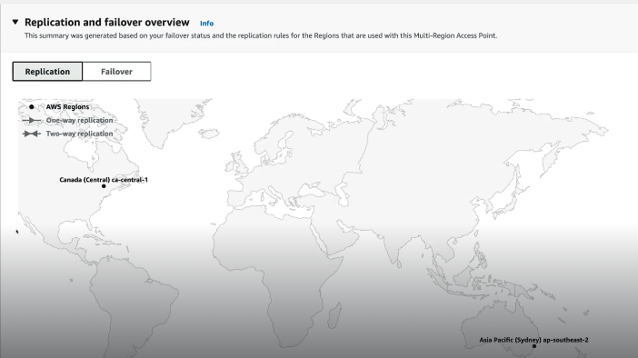

# Multi-Region Access Points (MRAP)

Amazon Simple Storage Service (S3) Multi-Region Access Points provide a global endpoint for routing Amazon S3 request traffic between AWS Regions. Each global endpoint routes Amazon S3 data request traffic from multiple sources, including traffic originating in Amazon Virtual Private Clouds (VPCs), from on-premises data centers over AWS PrivateLink, and from the public internet without building complex networking configurations with separate endpoints. In this mini project we will cover Multi-region access points.

1 - Make sure you are logged in AWS using your admin account (with admin permissions, this is, the management account of the organization). In this mini project we will create two buckets on different regions: first on Asia Pacific (Sydney) (ap-southeast-2) and Canada (Central) (ca-central-1). We will create the first bucket in the Sydney region so make sure this region is selected, then move to the S3 console and open it on a new tab. Click on 'Create bucket' and provide a consistent name for the bucket, below make sure the correct region is selected, scroll down and check 'Enable' below 'Bucket versioning', scroll to the bottom and click on 'Create bucket'. Follow the same steps for the second bucket except picking the Canada region and providing a different and unique bucket name.  

2 - Once the buckets are created, we will step trhough the creation of the multi-region endpoint, so click on 'Multi-Region Access Points' in the menu on the left and next on 'Create Multi-Region Access Point'. For the name you can pick whatever you want (it does not need to be globally unique but instead unique in your AWS account), scroll down and click on 'Add buckets' on the 'Buckets' box. Add the buckets created in the previous step. Scroll down to the bottom and click on 'Create Multi-Region Access Point'. This process can take up to 24 hours in the worst cases to complete but tipically it created much faster (from 10 to 30 minutes), so wait until the endpoint is ready to go. 

3 - Next, we need to enable cross-region replication between both buckets since any incoming traffic to the endpoint will be automatically rerouted to the closes S3 bucket, so click on the Multi-Region Access Point we have just created and next on the 'Replication and failover' tab and you will be able to see a graphical representation of any Replication or Failover configuration.  

4 - Scroll down a little bit and we will come across the Failover Configuration. If we click on one of the buckets and next click on 'Edit' on the Routing Status tab we will be able to pick between 'Active' or 'Passive'. The configured to 'Passive' then the traffic will be only routed to this bucket if no active buckets exist. On our case leave the failover configuration of both buckets to 'Active'. 

5 - As mentioned before we needed to enable replication between buckets so scroll down and in the 'Replication rules' panel click on 'Create replication rules'. Two templates will be made available, and the choise of one or another depend on the type of configuration of our cross-region architecture. Since the set the failover configuration to 'Active' on both buckets, the first template will be fine (we want all the buckets to be the same, so pick the 'Replicate objects among all specified buckets' option).  

6 - 

