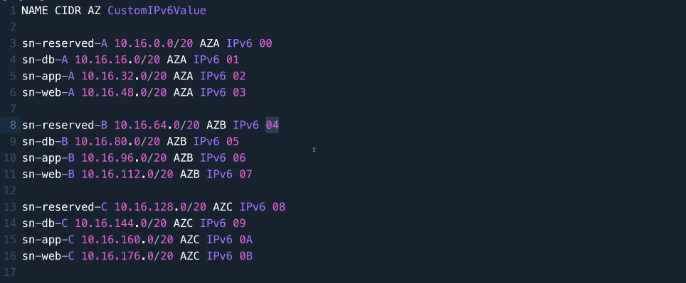

# Creation and Configuration of a Custom VPC End to End

In this lesson, we will step through the creation and configuration of a custom multi-tier VPC. The VPC will be populated with a number of subnets which will have access to the public internet via a VPC router and, next, an Internet Gateway located in the AWS Public Zone.
This custom architecture is important because it reflects a best-practice design for secure, scalable, and high-performing applications in the cloud. 

1 - As always, make sure you are logged in as the admin user in the N. Virginia region (us-east-1).  

2 - Next, go to the VPC console, select 'Your VPCs', and click on 'Create VPC'. From here, we can create the VPC only or create it along with other resources. For now, pick the 'VPC only' option under 'Resources to create' (during the next lessons we will be implementing the remaining components within the VPC). Next, give a name to the VPC and choose the 'IPv4 CIDR manual input' option so we can manually define the IP range for the subnets within our VPC. In the 'IPv4 CIDR' box, provide a reasonable range such as '10.16.0.0/16' (remember that IPv6 supports both private and public IP addresses, while by default IPv4 only supports private).  

3 - Select 'Amazon-provided IPv6 CIDR block' under 'IPv6 CIDR block' to support public IP addresses as well. Under 'Tenancy', select 'Default' (instances run on shared hardware with other AWS customers — choose 'Dedicated' if they must run on hardware physically isolated at the host level from instances that belong to other AWS accounts). Once you've done that, leave everything else as default and click on 'Create VPC' at the bottom of the page.  

4 - Every VPC comes with a unique identifier called a VPC ID, which can be found under 'Details' on the VPC panel of the one we have just created. Now, let's configure the DNS settings (DNS settings in custom VPCs are crucial because they control how resources inside the VPC resolve domain names). Click on 'Actions' and then on 'Edit VPC settings'. Next, make sure under 'DNS settings' that both DNS resolution and DNS hostnames are checked. Once you've done that, click on 'Save'.  

5 - Next, we will step through the creation of 4 subnets in each AZ: the Web subnet, the App subnet, the Database subnet, and the Reserved subnet. We will add all 4 to 3 different AZs (AZ A, B, and C). Attached to this repo you will find a document specifying the configuration of each subnet. It should look like this:  

The name of each subnet is stated at the beginning of each line, followed by its IPv4 CIDR range, then the AZ it belongs to, and at the end of the line the unique identifier of the IPv6 CIDR range (this last value will make sense at the subnet configuration step). Once you've opened that, go to the VPC console, click on 'Subnets' in the menu on the left, and then click on 'Create subnet' at the top right of the page. AWS allows you to create multiple subnets at once, so we will just need to repeat the same process 3 times (once for each AZ available in the VPC). Let's get started with AZ A. Under 'VPC ID', select the VPC ID of the VPC we created earlier from the dropdown menu. Once you've done that, we will start with 'Subnet 1 of 1'. Go back to the config.txt document attached to the repo (we will start with the reserved subnet), copy the subnet name and paste it into the 'Subnet name' box. Next, in the 'Availability Zone' box, pick the us-east-1a AZ (this will be our AZ A). Then, set 'IPv4 CIDR block' to 'Manual' and paste the IP range copied from the subnet configuration file. In the panel below, pick the IPv6 VPC CIDR block of your VPC and in 'IPv6 subnet CIDR block', paste the same CIDR range as above. With the arrows below, you can adjust the range of the subnet, so click two times on the down arrow (this means your subnet will be /64 sized while your VPC will be /56 — so the subnet fits inside the VPC). Also, to provide a unique IPv6 range for each subnet, change the last two digits of the number before the /<number> at the end of the address and paste the two digits found at the end of the subnet line in the configuration file (this will make each subnet's IPv6 range unique). Once you've done that, scroll to the bottom and click on 'Add new subnet'. Repeat the same steps for the remaining subnets in AZ A. Once all 4 subnets have been created in AZ A, scroll down and click on 'Create subnet'. 

6 - Follow the same steps for the other 2 AZs, setting 'Availability Zone' to us-east-1b for AZ B and us-east-1c for AZ C.  

7 - All 3 AZs have now been populated with 4 subnets each. There is one final step we need to complete for all of these subnets: each of them has an allocated IPv6 range. However, they are not set to auto-assign IPv6 addresses to resources created within them. To fix that, select each subnet, click on 'Actions', and then on 'Edit subnet settings'. Once there, check the box labeled 'Enable auto-assign IPv6 addresses'. Scroll down and click 'Save'. Repeat this step for all subnets within the VPC. In production environments, all these manual steps should be automated. So far, we end up with the following architecture sketched below.  

8 - At this point, all subnets are private and do not support communication with the AWS Public Zone. To allow public access for the WEB subnets, we need to implement an Internet Gateway, Route Tables, and appropriate Routes within the VPC. Once the WEB subnets are public, we can create a bastion host with a public IPv4 address and connect to it for testing. To begin, go to the VPC console. Create an Internet Gateway (a highly available object that provides public routing to and from the internet). In the left menu, click on 'Internet gateways' and then click on 'Create internet gateway' in the top right corner. Assign a name to the Internet Gateway and click on 'Create internet gateway'. By default, it is not attached to any VPC, so we need to do that manually. Click on 'Actions', then 'Attach to VPC', and in the 'Available VPCs' box, select your VPC ID. Click on 'Attach internet gateway' to make it available within your VPC (this enables the VPC to communicate with the public internet).  

9 - Next, we need to create a Route Table within the VPC to ensure traffic from the public subnets to the internet and vice versa is routed successfully. Two routes will be defined: one that allows traffic between the private and public subnets (IPv4), and another that allows communication between the public subnets and the public internet (IPv6). The latter route will point directly to the Internet Gateway we just created. Go to 'Route tables' in the left menu of the VPC console and click 'Create route table'. Choose your VPC ID and assign a name to the route table. Click 'Create route table'. You should now see the newly created object. Expand the overview section at the bottom of the page and go to 'Subnet associations'. Currently, it is not associated with any subnets. Click on 'Edit subnet associations' and select the three web subnets (intended for direct public access): sn-web-A, sn-web-B, and sn-web-C. Click 'Save associations'. Next, go to the 'Routes' tab. You will see two default routes: one for IPv6 and one for IPv4. These cannot be modified or deleted because they are catch-all routes. However, we can add additional routes. Click 'Edit routes' and add the following:

Destination: 0.0.0.0/0 (default IPv4 route)
Target: Internet Gateway (select the one you created)

Click 'Add route' again and add:

Destination: ::/0 (default IPv6 route)
Target: Internet Gateway (select the same one)

This ensures that any unknown traffic associated with this route table will be routed to the Internet Gateway. 

10 - Before launching any resources, we need to ensure that everything created in subnets sn-web-A, sn-web-B, and sn-web-C can be assigned a public IPv4 address. To do that, go to 'Subnets' in the left menu, locate and select sn-web-A, sn-web-B, and sn-web-C, then click on 'Actions' > 'Edit subnet settings'. This time, under 'Auto-assign IP settings', check the box labeled 'Enable auto-assign public IPv4 address'. Click 'Save'. This ensures that every resource created within these subnets will be allocated a public IPv4 address. 

